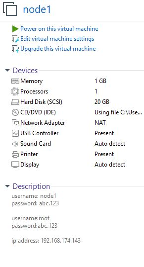
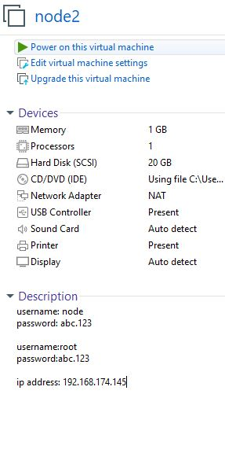
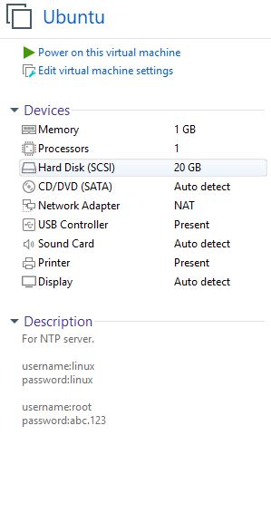
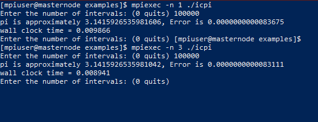
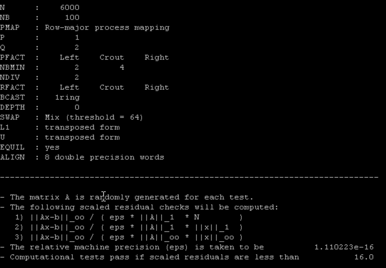
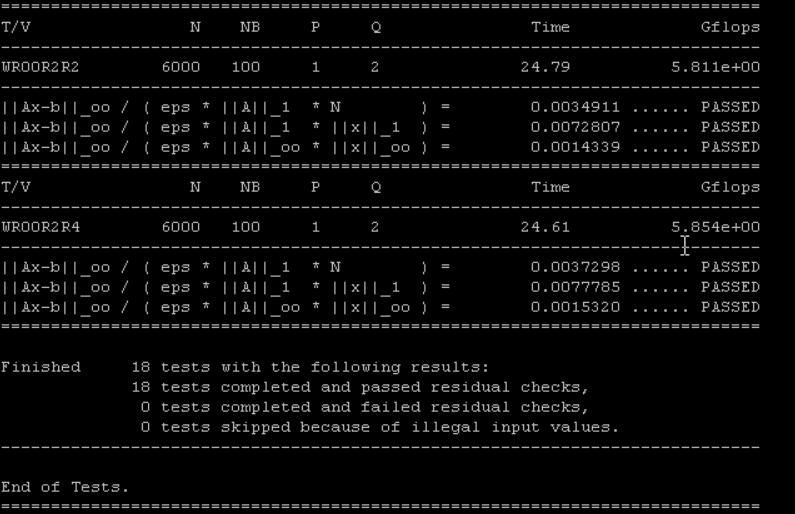

---

<p style='color:#FAF9F6;font-size:32px; font-weight:bold'> Parallel &amp; Distributed Computing </p>

<!-- PROJECT LOGO -->
<br />
<div align="center">

[![x][contributors-shield]][contributors-url]
[![Forks][forks-shield]][forks-url]
[![Stargazers][stars-shield]][stars-url]
[![Issues][issues-shield]][issues-url]
[![MIT License][license-shield]][license-url]

<br />
<br />
<br />

  <a href="https://github.com/SyedMustafaImam/HPCC-On-VMware-">
    
  </a>

<div id="top"></div>

<p style='font-size:32px; font-weight:bold'>Parallel &amp; Distributed Computing </p>
  <h3 align="center">HPC Cluster Configuration</h3>

  <p align="center">
    This documentation will help you create a hpcc system on vmware.
    <br />
    <a href="https://github.com/SyedMustafaImam/HPCC-On-VMware-"><strong>Explore the docs »</strong></a>
    <br />
    <br />
    <a href="https://github.com/SyedMustafaImam/HPCC-On-VMware-">Tutorial</a>
    ·
    <a href="https://github.com/SyedMustafaImam/HPCC-On-VMware-/tree/main/Packages_and_Softwares">Softwares</a>
    ·
    <a href="https://github.com/SyedMustafaImam/HPCC-On-VMware-/issues">Issues</a>
  </p>

<p style='font-size:21.4px; font-weight:bold'>Project Report</p>
<p style='font-size:15.1px; font-weight:bold'>Section: BSCS 7A</p>

<p style='font-size:15.1px; font-weight:bold'>By</p>
<p style='font-size:15.1px;'>

[Syed Mustafa Imam][linkedin-url-mustafa]

[Syed Hurrar Hassan Rizvi][linkedin-url-hurrar]

[Elliott Franscis Joseph][linkedin-url-elliott]

[Hirdesh Kumar][linkedin-url-hirdesh]

</div>

<br />

---

</div>

<p style='color:white;font-size:28px;font-weight:bold'>
Table of contents
</p>

- [**1.Introduction to HPC Cluster**](#1introduction-to-hpc-cluster)
- [**2.Use Cases**](#2use-cases)
  - [**Research Labs**](#research-labs)
  - [**Media And Entertainment**](#media-and-entertainment)
  - [**Oil and gas**](#oil-and-gas)
  - [**Artificial Intelligence**](#artificial-intelligence)
  - [**Financial Services**](#financial-services)
- [**3.Steps**](#3steps)
  - [**Creation Of Virtual Machines**](#creation-of-virtual-machines)
  - [**Linux Installation on nodes**](#linux-installation-on-nodes)
  - [**Configuring etc host file**](#configuring-etc-host-file)
  - [**SSH equivalence establishment for user root**](#ssh-equivalence-establishment-for-user-root)
  - [**Setup NTP Service**](#setup-ntp-service)
  - [**Installation of PDSH**](#installation-of-pdsh)
  - [**Setup NFS**](#setup-nfs)
  - [**Creation of ordinary user and also setup SSH equivalence**](#creation-of-ordinary-user-and-also-setup-ssh-equivalence)
  - [**Installation of prerequisites packages (GCC, G77, etc)**](#installation-of-prerequisites-packages-gcc-g77-etc)
  - [**Installation of MPI**](#installation-of-mpi)
  - [**Compiling Linpack**](#compiling-linpack)
  - [**Benchmarking**](#benchmarking)

# **1.Introduction to HPC Cluster**

HPC Cluster is a collection of hundreds or thousands of servers that are networked together, each server is known as a node. Each node in a cluster works in parallel with each other, boosting processing speed to deliver high-performance computing. HPC is appropriate for most small and medium-sized businesses since these nodes are tightly, this is the reason why it is called a cluster. All cluster nodes have the same components as a laptop or desktop such as the CPU, cores, memory, and storage space. The difference between a personal computers and a cluster node is in quantity, quality, and power of the components. User login to the cluster head node is done by using the ssh program.

<p align="right">(<a href="#top">back to top</a>)</p>

# **2.Use Cases**

HPC is deployed on-premises, at the edge, or in the cloud. HPC solutions are used for a variety of purposes across multiple industries. HPC is used to help scientists find sources of renewable energy, understand the evolution of our universe. Predict and track the storms, and create new materials.

<p align="right">(<a href="#top">back to top</a>)</p>

## **Research Labs**

HPC is used to help scientists find sources of renewable energy, understand the evolution of our universe, predict and track storms and create new materials.

<p align="right">(<a href="#top">back to top</a>)</p>

## **Media And Entertainment**

HPC is used to edit feature films, render mind-blowing visual effects, and stream live events around the world.

<p align="right">(<a href="#top">back to top</a>)</p>

## **Oil and gas**

HPC is used to more accurately identify where to drill for new oil wells and to help boost production from existing oil wells.

<p align="right">(<a href="#top">back to top</a>)</p>

## **Artificial Intelligence**

HPC is used to detect credit card fraud, provide self-guided technical support, self-driving vehicles, and improve cancer screening techniques.

<p align="right">(<a href="#top">back to top</a>)</p>

## **Financial Services**

HPC is used to track real-time stock trends and automate trading.

<p align="right">(<a href="#top">back to top</a>)</p>

# **3.Steps**

## **Creation Of Virtual Machines**

The master node is set up by the name &#39;HPC Master&#39; with CentOS-5 32 bit as the main OS of the Virtual Machine and the network working on a NAT. The system configuration of our HPC masternode is presented below:


The compute node is also created by the name &#39;node1&#39; with CentOS-5 32 bit as the main OS of the Virtual Machine with a standard data store and a NAT. The system configuration of the node1 are presented below:



Another compute node is also created by the name &#39;node2&#39; with Centos-5 32 bit as the main OS of the Virtual Machine with a standard data store and a NAT. The system configuration of the node2 are presented below:



An NTP server was also created by using a node that is not part computation performed by a cluster. It was done by using Ubuntu OS 64 bit as the main OS of the Virtual Machine with a standard data store and a NAT network. System configurations are presented below:



<p align="right">(<a href="#top">back to top</a>)</p>

## **Linux Installation on nodes**

You can download the iso image of CentOS 5.2 here:https://archive.org/details/cent-os-5.2-i-386-bin-dvd

After booting up from the image it will automatically go into the install node.

Once it asks for input, press skip for skipping the media check.

Create a custom layout then add a partition with file type **swap** and size of **128MB** and additional size options as **fixed size** , then press ok.

Repeat the process one more time to create another partition with **ext3** file type and size of **128MB** and additional size options as **fixed to maximum allowable size** , then press ok.

Once we have a disk that is all you need. It&#39;s going to have the hostname manually entered as the **master node,** then press edit above and uncheck **Enable IPv6 support**. Change dynamic IP to manual IP as **192.168.174.142** and prefix/netmask as **255.255.255.0** then press okay then press next then again next then continue as We don&#39;t want any gateway no DNS and let&#39;s specify our timezone, so press next.

Specify the password as abc.123 then press next.

Uncheck desktop and just click customize now by select packages from the options. We don&#39;t requir a desktop. We want **editors** , **development libraries, and development tools**. Go to the base system, uncheck **dial network support**.

So that is all you will need right now. so just go to next. Press Next to start the installation and so on, we will be done.

Once the system is completely installed, select reboot.

Remember that your nodes in your HPC cluster should be of the same hardware, same processor architecture, and the same version of the operating system you&#39;re using.

Let your system boot up. So this is how you would install CentOS 5.

On a virtual machine now we&#39;ve two more nodes to go on which we need to install the Linux operating system. Once we&#39; have our desired configurations of the system, we will copy the files from the backend. This is because we have VMware Workstaion Pro 16 that does not support cloning. So what we will be doing is shutting down this server/system/VM, and now copying its file disk file. As your server is turned off, let&#39;s go to the backend.

We have used Ubuntu as for our NTP server. You can use any distribution of Linux or Windows version for this task. After powering the Ubuntu virtual machine, select an language of your understand and press Install Ubuntu Button. Select an keyboard layout, after this choose normal installation then select earse disk and install Ubuntu option. Select an timezone and setup login credentials. Press continue and wait for the installation to complete. 

From our hostmachine console we modify the folders of Virtual Machines files.

You can download the nodes here:https://drive.google.com/drive/folders/1P3KzqFtmWejV8prhWgSvIFon_LInhR_g?usp=sharing

**Command:**

```console
[root@hostmachine ~]# cd machines
```

**Command:**


```console
[root@hostmachine machines]# ls
```

And we have this HPC masternode directory, which we have these files.

Let&#39;s enter into this directory by,

**Command:**

```console
[root@hostmachine machines]# cd masternode
```

**Command:**

```console
[root@hostmachine masternode]# ls
```

**Command:**

```console
[root@hostmachine masternode]# ls -lh
```

As you can see, this is your virtual machine disk file named **masternode.vmdk** .

So now we&#39;ll copying this file.

**Command:**

```console
[root@hostmachine masternode]# ls -lh ../node1/
```

As you can see you have four files there. Now we will copy this VMDK file from here and overwrite this VMDK file here.

**Command:**

```console
[root@hostmachine masternode]# cp masternode.vmdk ../node1/node1.vmdk
```

Press y for yes overwriting.

As you can see the file is copied so let&#39;s check the list.

**Command:**

```console
[root@hostmachine masternode]# ls ../node1/ -lh
```

Let&#39;s try starting node1 and see what happens. Click power on and go to the console window and let it boot up. It will have all settings from your masternode. That means it will also have the same hostname, same IP everything.

Once this is booted up. So let&#39;s go to the console, it will seem like a master node, but it is not it is, as you can see here, this is **node1** and in the same way, we&#39;ll do the **node2** as well. But first, adjust the hostnames.

**Command:**

```console
[root@masternode ~]# vi /etc/sysconfig/network
```

Then edit hostname as **node1** and the IP is going to be.

**Command:**

```console
[root@masternode ~]# vi /etc/sysconfig/network-scripts/ifcfg-eth0
```

First Ethernet network interface card or NIC in the system should not get its IP from DHCP. It&#39;s going to be a static IP address equal to 192.168.174.143 and netmask is equal to 255.255.255.0

One more thing to see hosts.

**Command:**

```console
[root@masternode ~]# vi /etc/hosts
```

Remove this master node at all from the script.

Now let&#39;s change the hostname manually.

**Command:**

```console
[root@masternode ~]# hostname node1
```

**Command:**

```console
[root@masternode ~]# service syslog restart
```

**Command:**

```console
[root@masternode ~]# less /var/log/messages
```

It will make sure that the logs in the various log messages are written correctly.

Press **shift G** you can see as soon as you&#39;ve restarted syslog the logs here it says node1 now before it was masternode.

Then reboot this system.

**Command:**

```console
[root@masternode ~]# reboot
```

Now repeat the same process for node2 as you have done for the node1.

<p align="right">(<a href="#top">back to top</a>)</p>

## **Configuring etc host file**

**Command:**

```console
[root@masternode ~]# vi /etc/hosts
```

Now delete IP version 6 naming file.

Then remove a masternode from this localhost line.

Add three lines here

192.168.174.142 masternode

192.168.174.143 node1

192.168.174.145 node2

Then save the these changes and return to the console.

**Command:**

```console
[root@masternode ~]# scp /etc/hosts node1:/etc/ 
```

Except for the fingerprint of node1, node1&#39;s password is abc.123.

Do the same thing for node2.

**Command:**

```console
[root@masternode ~]# scp /etc/hosts node2:/etc/
```

Except for the fingerprint of node2, node2&#39;s password is abc.123.

Now, the, etc hosts file is configured.

<p align="right">(<a href="#top">back to top</a>)</p>

## **SSH equivalence establishment for user root**

Now we will generate public and private keys (DSA and RSA) of all nodes.

Generate DSA keys.

**Command:**

```console
[root@masternode ~]# ssh-keygen -t dsa
```

Just press enter, no need to enter a passphrase.

Now generate the RSA keys.

**Command:**

```console
[root@masternode ~]# ssh-keygen -t rsa
```

Just press enter, no need to enter a passphrase.

Now if you want you can check these keys.

**Command:**

```console
[root@masternode ~]# cd .ssh/
```

**Command:**

```console
[root@masternode .ssh]# ls -l
```

As you can see both DSA and RSA are visible along with the public and private keys.

Now copy all four key files for this directory

**Command:**

```console
[root@masternode .ssh]# cd ..
```

**Command:**

```console
[root@masternode ~]# scp -r .ssh node1:/root/
```

Enter the password which is redhat

As files are copied in node 1 now do the same process for node 2.

**Command:**

```console
[root@masternode ~]# scp -r .ssh node2:/root/
```

Now do one more step

**Command:**

```console
[root@masternode ~]# cd .ssh/
```

**Command:**

```console
[root@masternode .ssh]# cat *.pub >> authorized\_keys
```

**Command:**

```console
[root@masternode .ssh]# cd ..
```

Now copy these files on both nodes again

**Command:**

```console
[root@masternode ~]# scp -r .ssh node1:/root/
```

Enter the password which is redhat

As files are copied in node 1 now do the same process for node 2.

**Command:**

```console
[root@masternode ~]# scp -r .ssh node2:/root/
```

Now We will generate RSA fingerprints,

**Command:**

```console
[root@masternode ~]# ssh-keyscan -t dsa masternode node1 node2
```

Now I&#39;m going to put it in a special file on this log

**Command:**

```console
[root@masternode ~]# ssh-keyscan -t dsa masternode node1 node2 > /etc/ssh/ssh_known_hosts
```

You see this file. This file is a valid one, but it does not exist by default. Now what I&#39;m going to do is I&#39;m going to scan the RSA keys of the same nodes and I&#39;m going to append that to this file.

**Command:**

```console
[root@masternode ~]# ssh-keyscan -t rsa masternode node1 node2 >> /etc/ssh/ssh_known_hosts
```

Now see how the file looks like,

**Command:**

```console
[root@masternode ~]# less /etc/ssh/ssh_known_hosts
```

Now replicate this file to all nodes.

**Command:**

```console
[root@masternode ~]# scp /etc/ssh/ssh_known_hosts node1:/etc/ssh
```

**Command:**

```console
[root@masternode ~]# scp /etc/ssh/ssh_known_hosts node2:/etc/ssh
``` 

**Testing by logging it into each node**

**Command:**

```console
[root@masternode ~]# ssh masternode
```

**Command:**

```console
[root@masternode ~]# exit
```

**Command:**

```console
[root@node1 ~]# ssh node1
```

**Command:**

```console
[root@node1 ~]# exit
```

**Command:**

```console
[root@masternode ~]# ssh node2
```

**Command:**

```console
[root@node2 ~]# exit  
```

**Testing by logging all nodes into each other node**

**Command:**

```console
[root@node1 ~]# ssh masternode uptime
```


**Command:**

```console
[root@node1 ~]# ssh node1 uptime
```

**Command:**

```console
[root@node1 ~]# ssh node2 uptime
```


<p align="right">(<a href="#top">back to top</a>)</p>

## **Setup NTP Service**

**Setup NTP in Ubuntu**

Update our local repository

**Command:**

```console
[root@linux ~]# apt-get update
```

Install NTP server daemon.

**Command:**

```console
[root@linux ~]# apt-get install ntp
```

Switch to an NTP server pool closest to your location


**Command:**

```console
[root@linux ~]# vi /etc/ntp.conf
```
In this file, you will be able to see a pool list.


**Use servers from the NTP Pool Project. Approved by Ubuntu Technical Board
on 2011-02-08 (LP: #104525). See http://www.pool.ntp.org/join.html for more information.**

Add the following lines if not added automatically.

pool 0.ubuntu.pool.ntp.org iburst
pool 1.ubuntu.pool.ntp.org iburst
pool 2.ubuntu.pool.ntp.org iburst
pool 3.ubuntu.pool.ntp.org iburst

Exit the file.

Restart the NTP server.

**Command:**

```console
[root@linux ~]# service ntp restart
```

Check NTP server status.

**Command:**

```console
[root@linux ~]# service ntp status
```

Configure Firewall to allow nodes access to NTP server

**Command:**

```console
[root@linux ~]# ufw allow from any to any port 123 proto udp
```


**Command:**

```console
[root@linux ~]# ip a
```
The IP address of Ubuntu is 192.168.174.131, so NTP server IP would be same.

**Install NTP service on masternode.**


**Command:**
```console
[root@masternode ~]# rpm –-import /etc/pki/rpm-gpg/RPM-GPG-KEY-CentOS-5
```

**Command:**

```console
[root@masternode ~]# yum -y install ntp
```

**Command:**

```console
[root@masternode ~]# scp node1:/etc/yum.repos.d/CentOS-Base.repo .
```

**Command:**

```console
[root@masternode ~]# scp node1:/etc/yum.repos.d/CentOS-Base.repo /etc/yum.repos.d/
```

**Install NTP service on node2.**


**Command:**

```console
[root@node2 ~]# rpm –-import /etc/pki/rpm-gpg/RPM-GPG-KEY-CentOS-5
```

**Command:**

```console
[root@node2 ~]# scp node1:/etc/yum.repos.d/CentOS-Base.repo /etc/yum.repos.d/
```

**Command:**

```console
[root@node2 ~]# yum -y install ntp
```

**Install NTP service on node1.**


**Command:**

```console
[root@nodeq ~]# rpm –-import /etc/pki/rpm-gpg/RPM-GPG-KEY-CentOS-5
```

**Command:**

```console
[root@node1 ~]# yum -y install ntp
```

**Configuration**


**NTP configuration masternode,node1,node2.**

**Command:**

```console
[root@masternode ~]# vi /etc/ntp.conf
```
Add server 192.168.174.131 which is our host machine.

Comment server 0, server 1, server 2

Comment server local-clock and fudge

Exit the file


**Command:**

```console
[root@masternode ~]# chkconfig --level 35 ntpd on
```


Restart service

**Command:**

```console
[root@masternode ~]# service ntpd restart
```

**Command:**

```console
[root@masternode ~]# ntpq -p -n
```

**Command:**

```console
[root@masternode ~]# watch "ntpq -p -n"
```

**Command:**

```console
[root@masternode ~]# scp /etc/ntp.conf node1:/etc/ntp.conf
```

**Command:**

```console
[root@node1 ~]# chkconfig --level 35 ntpd on
```


Restart service

**Command:**

```console
[root@node1 ~]# service ntpd restart
```

**Command:**

```console
[root@node1 ~]# ntpq -p -n
```

**Command:**

```console
[root@node1 ~]# watch "ntpq -p -n"
```

**Command:**

```console
[root@node1 ~]# scp /etc/ntp.conf node2:/etc/ntp.conf
```


**Command:**

```console
[root@node2 ~]# chkconfig --level 35 ntpd on
```


Restart service

**Command:**

```console
[root@node2 ~]# service ntpd restart
```

**Command:**

```console
[root@node2 ~]# ntpq -p -n
```

**Command:**


```console
[root@node2 ~]# watch "ntpq -p -n"
```

##

<p align="right">(<a href="#top">back to top</a>)</p>

## **Installation of PDSH**

Check if pdsh is downloaded on the host machine or not.

**Command:**

```console
[root@linux linux]# cd
```

**Command:**

```console
[root@linux ~]# ls
```

If it is not downloaded you can download it from the SourceForge website by typing pdsh on google search.

Now copy pdsh from masternode

**Command:**

```console
[root@masternode ~]# scp 192.168.174.131:/root/pdsh* .
```

Type yes

Enter the password which is abc.123,

PDSH is now copied.

Rebuild rpm

**Command:**

```console
[root@masternode ~]# rpmbuild –rebuild pdsh-2.18-1.src.rpm
```

This is not mandatory for all nodes other than masternode

Changing directory

**Command:**

```console
[root@masternode ~]# cd /usr/src/redhat/RPMS/i386/
```

**Command:**

```console
[root@masternode i386]# rpm -ivh pdsh-*
```

Now wait until it is debugging and installing

Now everything is installed and pdsh works.

What does pdsh do? If you want to perform a certain operation on all the nodes, or any specific nodes, one way is to manually log in through SSH to each node and perform the task and the second is you can just tell PD shell to do it at will go out and perform that task on all the nodes. It&#39;s very simple. So suppose you want to execute the date command on all the nodes or uptime command on all the nodes or whatever. So you would just tell PD shell to do it but in order for PD shell to work, it needs a machine file.

**Command:**

```console
[root@masternode i386]# vi /etc/machines
```

Add these three lines

masternode

node1

node2

These are the three nodes that I&#39;m going to use or which will be used for PD shall.

Now execute the pdsh on all nodes.

What executes what let&#39;s say date, is simple.

**Command:**

```console
[root@masternode i386]# pdsh -a date
```

It went out on all the nodes and it brought the output back from all the notes you see it they&#39;re all 100% At the same time that&#39;s not the because of PDSH because of NTP which we just set up you Just go to masternode and enter.

**Command:**

```console
[root@masternode i386]# pdsh -a ntpq -p -n
```

<p align="right">(<a href="#top">back to top</a>)</p>

## **Setup NFS**

Now setup nfs on masternode

Coming back to home directory

**Command:**

```console
[root@masternode i386]# cd
```

**Command:**

```console
[root@masternode ~]# vi /etc/exports/
```

Add

```console
/cluster       *(rw,no_root_squash,sync)
```

Save and exit

Restart NFS service

**Command:**

```console
[root@masternode ~]# service nfs restart
```

Check Configuration

**Command:**

```console
[root@masternode ~]# chkconfig -–level 35 nfs on
```

Make a directory

**Command:**

```console
[root@masternode ~]# mkdir /cluster
```

Again restart service

**Command:**

```console
[root@masternode ~]# service nfs restart
```

Now we have to create this directory on all nodes so we will just use pdsh to create on all nodes at once

**Command:**

```console
[root@masternode ~]# pdsh -w node1,node2 mkdir /cluster
```

Now mounting

**Command:**

```console
[root@node1 yum.repos.d]# df -hT
```

Execute this command on node1

**Command:**

```console
[root@node1 yum.repos.d]# mount -t nfs masternode:/cluster /cluster/
```

Execute this command on node2

**Command:**

```console
[root@node2 ~]# mount -t nfs masternode:/cluster /cluster/
```

Now you can see that it is written that you have mounted it from the masternode.

**Now specify etc/fstab on node1**

**Command:**

```console
[root@node1 ~]# vi /etc/fstab
```

Add this line
```console
masternode:/cluster /cluster  nfs defaults  0 0
```
Kindly disable firewall in masternode,node1 and node2.

**Now specify etc/fstab on node2**

**Command:**

```console
[root@node2 ]# vi /etc/fstab
```

Add this line

```console
masternode:/cluster /cluster nfs defaults 0 0
```

<p align="right">(<a href="#top">back to top</a>)</p>

## **Creation of ordinary user and also setup SSH equivalence**

**Group:** mpigroup-600

**User:** mpiuser-600

Member of mpigroup

The home directory will be /cluster/mpiuser

Now coming back to the masternode.

**Command:**

```console
[root@masternode ~]# groupadd -g 600 mpigroup
```

**Command:**

```console
[root@masternode ~]# useradd -u 600 -g 600 -d /cluster/mpiuser mpiuser
```

This directory is now created.

Now add group and users on node1 and node2

Run these commands on each node separately

**Command:**

```console
[root@node1 ~]# groupadd -g 600 mpigroup
```
```console
[root@node1 ~]# useradd -u 600 -g 600 -d /cluster/mpiuser mpiuser
```
**Command:**

```console
[root@node2 ~]# groupadd -g 600 mpigroup
```
```console
[root@node2 ~]# useradd -u 600 -g 600 -d /cluster/mpiuser mpiuser
```
Our users and groups are now created on all nodes.

Now we are setting up SSH user equivalence for MPI to funciton properly.

**Command:**

```console
[root@masternode ~]# su - mpiuser
```

Generate its sshkeys as well

**Command:**

```console
[mpiuser@masternode ~]$ ssh-keygen -t dsa
```

Press enter no need to enter paraphrase

**Command:**

```console
[mpiuser@masternode ~]$ ssh-keygen -t rsa
```

Press enter no need to enter paraphrase

As two key pairs are generated

Now,

**Command:**

```console
[mpiuser@masternode ~]$ ls /cluster/
```

Switch to mpiuser from node1

**Command:**

```console
[root@node1 ~]# su - mpiuser
```

**Command:**

```console
[mpiuser@node1 ~]$ ls -l
```

Check all the files here

**Command:**

```console
[mpiuser@node1 ~]$ ls -la
```

Now changing directory

**Command:**

```console
[mpiuser@node1 ~]$ cd .ssh/
```

**Command:**

```console
[mpiuser@node1 .ssh]$ ls -la
```

Remember /cluster directory is shared across all nodes.

Append the public keys into the authorized keys file

**Command:**

```console
[mpiuser@masternode .ssh]$ cat *.pub >> authorized_keys
```

**Command:**

```console
[mpiuser@masternode .ssh]$ cd ..
```

Now try to command as a mpiuser on all nodes

**Command:**

```console
[mpiuser@masternode ~]$ ssh masternode uptime
```

**Command:**

```console
[mpiuser@masternode ~]$ ssh node1 uptime
```

**Command:**

```console
[mpiuser@masternode ~]$ ssh node2 uptime
```

Check hostname by ssh command

**Command:**

```console
[mpiuser@masternode ~]$ ssh masternode hostname
```

**Command:**

```console
[mpiuser@masternode ~]$ ssh node1 hostname
```

**Command:**

```console
[mpiuser@masternode ~]$ ssh node2 hostname
```

Hostnames of each node must be visible by these commands.

Now check hostnames by PDSH

**Command:**

```console
[mpiuser@masternode ~]$ pdsh -a hostname
```

<p align="right">(<a href="#top">back to top</a>)</p>

## **Installation of prerequisites packages (GCC, G77, etc)**

Check if all nodes have GCC or not

**Command:**

```console
[root@masternode ~]# rpm -q GCC
```

The version of GCC will be visible

**Command:**

```console
[root@masternode ~]# rpm -qa | grep g77
```

If not shown by this command you can run

**Command:**

```console
[root@masternode ~]# yum list | grep g77
```

If g77 exists this will be visible there.

Install g77 on masternode

**Command:**

```console
[root@masternode ~]# yum -y install compat-gcc-34-g77
```

Installing g77 on node1 and node2 from masternode

**Command:**

```console
[root@masternode ~]# pdsh -w node1,node2 yum -y install compat-gcc-34-g77
```

All prerequisites are now installed.

<p align="right">(<a href="#top">back to top</a>)</p>

## **Installation of MPI**

Now, we go for MPI installation.

So, MPI is basically Message Passing Interface is the language that is used to run a program specially designed program on multiple compute nodes on multiple nodes. MPI can be downloaded from various places there is open MPI this there are other MPI as well. I&#39;m going to download it from the web.

**Command:**

```console
[mpiuser@masternode ~]$ scp root@10.0.0.2:/root/mpi* .
```

Press yes

Enter password redhat

Mpi is downloaded in the home directory

**Command:**

```console
[mpiuser@masternode ~]$ ls -lh
```

The file is not owned by mpiuser

**Command:**

```console
[root@masternode /]# chown mpiuser:mpigroup /cluster -R
```

Access is now given to mpiuser

Switch user to mpiuser

**Command:**

```console
[root@masternode /]# su - mpiuser
```

Moving mpi

**Command:**

```console
[mpiuser@masternode ~]$ mv mpich2-1.0.8.tar.gz ..
```

**Command:**

```console
[mpiuser@masternode ~]$ ls
```

**Command:**

```console
[mpiuser@masternode ~]$ cd ..
```

**Command:**

```console
[mpiuser@masternode cluster]$ ls -lh
```

As you can see it is nowhere.

Now uncompressing

**Command:**

```console
[mpiuser@masternode cluster]$ tar xzf mpich2-1.0.8.tar.gz
```

**Command:**

```console
[mpiuser@masternode cluster]$ ls
```

**Command:**

```console
[mpiuser@masternode cluster]$ cd mpich2-1.0.8
```

**Command:**

```console
[mpiuser@masternode mpich2-1.0.8]$ ls
```

There are so many files we are now configuring.

This will be a new directory.

**Command:**

```console
[mpiuser@masternode mpich2-1.0.8]$ ./configure –-prefix=/cluster/mpich2
```

All the parts which were left during the installation will be installed by this command.

**Command:**

```console
[mpiuser@masternode mpich2-1.0.8]$ make
```

Now the files will move to /cluster directory

**Command:**

```console
[mpiuser@masternode mpich2-1.0.8]$ make install
```

next, I&#39;m going to set up some environment variables in the MPI user&#39;s bash\_profile.

First goto home directory

**Command:**

```console
[mpiuser@masternode mpich2-1.0.8]$ cd
```

**Command:**

```console
[mpiuser@masternode ~]$ vi .bash_profile
```

Add these lines there

```console
PATH=$PATH:$HOME/bin:/cluster/mpich2/bin

LD\_LIBRARY\_PATH=$LD\_LIBRARY\_PATH:/cluster/mpich2/lib

export PATH

export LD\_LIBRARY\_PATH
```

If you don&#39;t want to logout

**Command:**

```console
[mpiuser@masternode ~]$ source .bash_profile
```

This will load the new values

You can also verify by the echo command

**Command:**

```console
[mpiuser@masternode ~]$ echo $PATH
```

Check if it is able to find MPD

**Command:**

```console
[mpiuser@masternode ~]$ which mpd
```

Check if it is able to find mpiexec

**Command:** 

```console
[mpiuser@masternode ~]$ which mpiexec
```

Check if it is able to find mpirun

**Command:**

```console
[mpiuser@masternode ~]$ which mpirun
```

Create an mpd.host file

**Command:**

```console
[mpiuser@masternode ~]$ cat >> /cluster/mpiuser/mpd.hosts << EOF
```

**>** masternode

**>** node1

**>** node2

**>** EOF

Check the names here of all nodes

**Command:**

```console
[mpiuser@masternode ~]$ cat /cluster/mpiuser/mpd.hosts
```
masternode

node1

node2

If you don&#39;t want your masternode to take part in any kind of computation follow the command below.

**Command:**

```console
[mpiuser@masternode ~]$ vi /cluster/mpiuser/mpd.hosts
```

Remove masternode from here and exit

Now creating a secret file

**Command:**

```console
[mpiuser@masternode ~]$ vi /cluster/mpiuser/.mpd.conf
```

Add this line

secretword=redhat

Save and exit

Boot mpt on compute nodes

**Command:**

```console
[mpiuser@masternode ~]$ mpd &
```

If it has permission issue follow below command

**Command:**

```console
[mpiuser@masternode ~]$ chmod 0600 /cluster/mpiuser/.mpd.conf
```

**Command:**

```console
[mpiuser@masternode ~]$ ps aux | grep mpd
```

Now again Booting mpt on compute nodes

**Command:**

```console
[mpiuser@masternode ~]$ mpd &
```

Checking if it&#39;s running

**Command:**

```console
[mpiuser@masternode ~]$ mpdtrace -l
```

Exit all

**Command:**

```console
[mpiuser@masternode ~]$ mpdallexit
```

**Command:**

```console
[mpiuser@masternode ~]$ mpdboot -n 2 --chkuponly
```

Now you can see 2 hosts are up

**Command:**

```console
[mpiuser@masternode ~]$ ps aux | grep mpd
```

Now edit this file

**Command:**

```console
[mpiuser@masternode ~]$ vi /cluster/mpiuser/mpd.hosts
```

Add this line

Masternode

Save and exit

Checking how many servers are up

**Command:**

```console
[mpiuser@masternode ~]$ mpdboot -n 3 --chkuponly
```

Now you can see 3 hosts are up

**Command:**

```console
[mpiuser@masternode ~]$ mpdboot -n 3
```

**Command:**

```console
[mpiuser@masternode ~]$ mpdtrace
```

Now exit from all

**Command:**

```console
[mpiuser@masternode ~]$ mpdexitall
```

Now check if I am traced or not

**Command:**

```console
[mpiuser@masternode ~]$ mpdtrace
```

Run each command separately and see the time difference

**Command:**
```console
[mpiuser@masternode ~]$ cd ..
```
```console
[mpiuser@masternode cluster]$ cd mpich2-1.0.8/examples
```
```console
[mpiuser@masternode examples]$ mpiexec -n 1 ./cpi
```

As you can see execution time

**Command:**

```console
[mpiuser@masternode examples]$ mpiexec -n 2 ./cpi
```

**Command:**

```console
[mpiuser@masternode examples]$ mpiexec -n 3 ./cpi
```

Compiling a program

**Command:**

```console
[mpiuser@masternode examples]$ mpicc -o icpi icpic.c
```

**Command:**

```console
[mpiuser@masternode examples]$ ls
```

It&#39;s compiled.

**Command:**

```console
[mpiuser@masternode examples]$ mpiexec -n 1 ./icpi
```

Enter any large random number and see the execution time.

Now run this using 2 nodes

**Command:**

```console
[mpiuser@masternode examples]$ mpiexec -n 1 ./icpi
```

Enter the same number and see the execution time difference.

On virtual machines, it might give higher time but in physical servers, it will be okay sometimes it gets problematic in VM&#39;s.




Remember real hardware clusters will give much accuracy and proficiency.

<p align="right">(<a href="#top">back to top</a>)</p>

## **Compiling Linpack**

For linpack, you would need a BLAS library.

Downlad the gotoblas library from here: https://www.tacc.utexas.edu/documents/1084364/1087496/GotoBLAS2-1.13.tar.gz/b58aeb8c-9d8d-4ec2-b5f1-5a5843b4d47b

You can download in the host machine and then copy it to master node.

**Command:**

```console
[root@hostmachine ~]# scp  -r GotoBLAS2-1.13.tar.gz root@10.0.0.20:/masternode/
```

Enter root's password

Now go to the master node and check it. 

**Command:**

```console
[root@masternode ~]# ls
```

Copy file

**Command:**

```console
[root@masternode ~]# cp GotoBLAS2-1.13.tar.gz /cluster/mpiuser/
```

Switching user

**Command:**

```console
[root@masternode ~]#  su - mpiuser
```

**Command:**

```console
[mpiuser@masternode ~]# ls -al
```

Uncompressing

**Command:**

```console
[mpiuser@masternode ~]# tar xzf GotoBLAS2-1.13.tar.gz
```

It will create a directory here

**Command:**

```console
[mpiuser@masternode ~]# cd GotoBLAS3-1.13
```

As it is seen, a directory is created.

BLAS is a linear algebra library

**Command:**

```console
[mpiuser@masternode GotoBLAS3-1.13]# ls
```

**Command:**

```console
[mpiuser@masternode GotoBLAS3-1.13]# make BIN=32
```

**Command:**

```console
[mpiuser@masternode GotoBLAS3-1.13]#  gmake TARGET=NEHALEM
```

It is compiled now.

Now you would need to download a high-performance linpack.

You can download it from [www.netlib.org/benchmark/hpl](https://www.netlib.org/benchmark/hpl/hpl-2.3.tar.gz)

Now copy it from the host machine

**Command:**

```console
[root@hostmachine ~]# scp -r hpl-2.3.tar.gz mpiuser@10.0.0.20:/cluster/mpiuser/
```

Enter password:

Check now if the file is here

**Command:**

```console
[mpiuser@masternode ~]# ls
```

The file is in the home directory of this mpiuser.

Extract or uncompress

**Command:**

```console
[mpiuser@masternode ~]# tar xzf hpl.tgz
```

**Command:**

```console
[mpiuser@masternode ~]# ls
```

**Command:**

```console
[mpiuser@masternode ~]# cd hpl
```

**Command:**

```console
[mpiuser@masternode ~]# ls
```

Copying setup

**Command:**

```console
[mpiuser@masternode hpl]# cp setup/Make.Linux_pII_FBLAS_gm .
```

Copying to the current location

Check your GCC version

**Command:**

```console
[mpiuser@masternode hpl]#  gcc -v
```

Select version

**Command:**

```console
[mpiuser@masternode hpl]# cd /usr/lib/gcc/i386-redhat-linux/4.1.2/
```

Check current location

**Command:**

```console
[mpiuser@masternode 4.1.2]#  pwd
```

**Command:**

```console
[mpiuser@masternode hpl]# vi Make.Linux_PII_FBLAS_gm
```

Change LA Directory in this file to

**$** (HOME) / GotoBLAS

Change LA Library

**$** (LAdir)/libgoto.a -lm -L/usr/lib/gcc/i386-redhad-linux/4.1.2

Change CC Flags

**$** (HPL\_DEFS) -03

Change Linker

**$** mpicc

Save and exit

<p align="right">(<a href="#top">back to top</a>)</p>

## **Benchmarking**

Now build this

**Command:**

```console
[mpiuser@masternode hpl]#  make arch=Linux_PII_FBLAS_gm
```

Moving to this directory

**Command:**

```console
[mpiuser@masternode hpl]# cd /cluster/mpiuser/hpl/bin/Linux_PII_FBLAS_gm/
```

List here

**Command:**

```console
[mpiuser@masternode Linux_PII_FBLAS_gm]# ls
```

Copy HPL.dat

**Command:**

```console
[mpiuser@masternode Linux_PII_FBLAS_gm]# cp HPL.dat HPL.dat.orig
```

**Command:**

```console
[mpiuser@masternode Linux_PII_FBLAS_gm]# vi HPL.dat
```

Now the linpack configuration file has appeared.

value from size can be found first, nothing to change.

**Command:**

```console
[mpiuser@masternode Linux_PII_FBLAS_gm]# free -b
```

Go to calculator on node2

**Command:**

```console
[root@node2 ~]# bc

< Sqrt (.1\*(value of the output of your free b) \* 2)

> 5997.8 approx 6000
```

Now edit this file on master node

**Command:**

```console
[mpiuser@masternode Linux_PII_FBLAS_gm]# vi HPL.dat
```

Edit No of problem to 1

Size 6000

No of block 1

Size of block 100

Process grid 1

The processor on each node 1

Processor quantity 2

Save and exit

First exit

**Command:**

```console
[mpiuser@masternode Linux_PII_FBLAS_gm]# mpdallexit
```

Boot again:

**Command:**

```console
[mpiuser@masternode Linux_PII_FBLAS_gm]# mpdboot -n 2
```

Now execute hpl program

**Command:**

```console
[mpiuser@masternode Linux_PII_FBLAS_gm]# mpiexec -n 2 ./xhpl
```



This is our benchmarking being started. This might take some time.

You can see complete passing and failing reports at the end of the benchmarking process.



Now execute hpl programe and send output to textfile

**Command:**

```console
[mpiuser@masternode Linux_PII_FBLAS_gm]# mpiexec -n 2 ./xhpl > performance.txt
```

[contributors-shield]: https://img.shields.io/github/contributors/othneildrew/Best-README-Template.svg?style=for-the-badge
[contributors-url]: https://github.com/SyedMustafaImam/HPCC-On-VMware-/graphs/contributors
[forks-shield]: https://img.shields.io/github/forks/othneildrew/Best-README-Template.svg?style=for-the-badge
[forks-url]: https://github.com/SyedMustafaImam/HPCC-On-VMware-/network/members
[stars-shield]: https://img.shields.io/github/stars/othneildrew/Best-README-Template.svg?style=for-the-badge
[stars-url]: https://github.com/SyedMustafaImam/HPCC-On-VMware-/stargazers
[issues-shield]: https://img.shields.io/github/issues/othneildrew/Best-README-Template.svg?style=for-the-badge
[issues-url]: https://github.com/SyedMustafaImam/HPCC-On-VMware-/issues
[license-shield]: https://img.shields.io/github/license/othneildrew/Best-README-Template.svg?style=for-the-badge
[license-url]: https://github.com/SyedMustafaImam/HPCC-On-VMware-/blob/master/LICENSE.txt
[linkedin-shield]: https://img.shields.io/badge/-LinkedIn-black.svg?style=for-the-badge&logo=linkedin&colorB=555

[linkedin-url]: https://linkedin.com/in/othneildrew
[product-screenshot]: images/screenshot.png

[linkedin-url-mustafa]: https://linkedin.com/in/syedmustafaimam
[linkedin-url-elliott]: https://www.linkedin.com/in/elliott-joseph-6436411ab/
[linkedin-url-hirdesh]: https://www.linkedin.com/in/hirdeshkumar2407/
[linkedin-url-hurrar]: https://www.linkedin.com/in/syedhurrarhasanrizvi/

[product-screenshot]: images/screenshot.png
